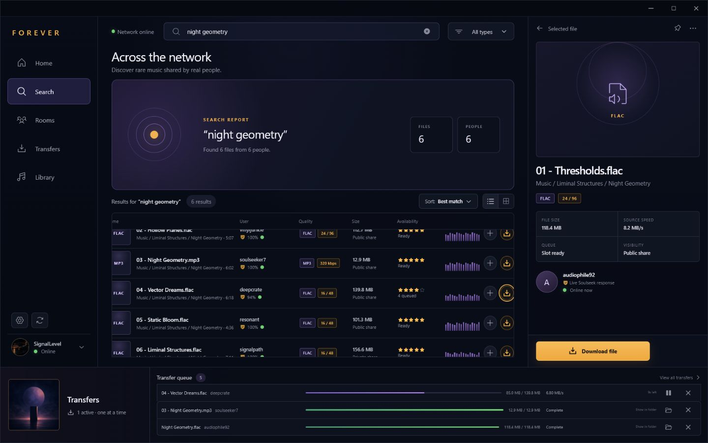

# Forever

Forever is a fast, polished desktop client for the Soulseek network, built with
Rust, Tauri 2, React, and TypeScript.

> **Status:** pre-alpha. Version `0.0.6` completes the first search-to-download
> journey: a live Soulseek result can now become a safe, resumable local file.



## Current foundation

- Faithful Midnight Radio desktop interface
- First-run Soulseek account setup with native download-folder selection and
  a clear explanation of automatic username registration
- Live TCP login to the Soulseek server with explicit connecting,
  authenticating, online, reconnecting, offline, and error states
- Automatic reconnect with bounded exponential backoff and optional connection
  on startup
- Live Soulseek search with direct and indirect peer-response handling,
  streamed and deduplicated results, a 15-second response window, and bounded
  protocol parsing
- Working lossless/compressed filters, ready/speed/size sorting, stop control,
  and a live file inspector with source speed, queue, and share visibility
- Real single-file downloads from live results using direct and indirect peer
  connections, with one active file at a time
- Persistent transfers with source-queue position, byte progress, speed, ETA,
  pause, resume, retry, cancel, completion, and Show in folder controls
- Safe `.part` files, resumable offsets, exact-size checks, sanitized local
  names, collision-free destinations, and no overwrite of existing files
- Passwords stored in Windows Credential Manager, or held only in memory when
  “Remember password” is disabled
- Non-secret JSON connection preferences and sanitized local diagnostics
- Local design-preview data when the React frontend runs outside Tauri
- Custom frameless Windows shell and branded application icons
- In-app update checks at startup and every five minutes by default, with a
  persistent cadence setting, toast, release modal, progress, verification,
  and restart flow
- GitHub CI for linting, typechecking, frontend tests, Rust formatting, Clippy,
  and Rust tests
- Automatic GitHub Releases containing NSIS `.exe` and WiX `.msi` installers
- Signed Tauri updater artifacts, `latest.json`, and SHA-256 checksums

## Requirements

- Node.js 22
- Rust stable
- Windows development prerequisites from the
  [Tauri documentation](https://v2.tauri.app/start/prerequisites/)

## Development

```powershell
npm install
npm run tauri dev
```

The frontend can also run independently:

```powershell
npm run dev
```

Use `http://localhost:1420/?update=available` during frontend development to
preview the update toast and modal without publishing a release.

Use `http://localhost:1420/?onboarding=1` to preview the fresh-install
connection flow. The browser preview simulates connection state; run
`npm run tauri dev` to exercise the native credential vault and live Soulseek
login and network search. Search for an artist, album, track, or filename while
connected; results stream into the table as peers respond. Each search listens
for responses for 15 seconds and can be stopped early. Select a live file and
choose **Download file**; Forever queues the exact remote filename in the shelf
and writes it to the download folder configured in Connection settings.

Version `0.0.6` intentionally downloads one file at a time. Album/folder
downloads, uploads, library management, and playback remain outside this first
download release.

Soulseek does not have a separate sign-up step. Connecting with a valid unused
username creates that account using the password you enter; only an existing
username can return a wrong-password error. Forever explains this in onboarding
and Connection settings rather than treating a successful registration as an
authentication failure.

Automatic update checks run every five minutes while Forever is open. Change
the cadence—or limit automatic checks to startup—in **Settings → Connection →
Automatic update checks**.

## Connection data and privacy

Forever writes non-secret account preferences to the Tauri application
configuration directory and connection events to
`logs/connection.log`. Transfer metadata is stored in `transfers.json` in the
same configuration directory; peer IP addresses and credentials are excluded.
Passwords are excluded from both. With “Remember
password” enabled, Windows Credential Manager stores the password; otherwise it
exists only for the current app session.

The legacy Soulseek protocol itself does not provide transport encryption.
Credential protection described above applies to local storage, not the
connection between the client and Soulseek server. Use a unique password that
you do not reuse for another service.

Live searches are sent to the Soulseek server, and responding peers connect to
Forever’s temporary listening port or receive an indirect connection attempt.
Forever limits concurrent peer connections, message sizes, decompressed
payloads, per-peer entries, and each search to 5,000 displayed files. Peer
addresses are used for the active protocol exchange and are not exposed in the
interface or written to diagnostics.

Incomplete files use a `.part` suffix and remain resumable. Forever accepts a
file stream only when its username, exact remote filename, transfer token, and
announced size match the active queue item. The Soulseek protocol does not
provide chunk hashes, so v0.0.6 verifies the expected byte count but cannot
cryptographically verify file contents.

## Quality checks

```powershell
npm run check
Set-Location src-tauri
cargo fmt --all -- --check
cargo clippy --all-targets --all-features -- -D warnings
cargo test --all-targets --all-features
```

## Release process

Every application release uses the same version in:

- `package.json`
- `src-tauri/Cargo.toml`
- `src-tauri/tauri.conf.json`
- the dated `CHANGELOG.md` release heading

Validate them locally with:

```powershell
npm run verify:version
```

Pushing a new version to `master` automatically runs the release workflow. Once
all frontend and Rust checks pass, GitHub Actions creates a `vX.Y.Z` tag and
publishes a GitHub Release containing:

- `Forever_X.Y.Z_x64-setup.exe` — recommended current-user Windows installer
- `Forever_X.Y.Z_x64.msi` — Windows Installer package
- updater signatures
- `latest.json`
- `SHA256SUMS.txt`

The release workflow requires the repository secret
`TAURI_SIGNING_PRIVATE_KEY`. The corresponding public key is compiled into the
application. Keep the private updater key backed up securely; losing it prevents
installed clients from accepting future updates.

Windows Authenticode signing is separate from Tauri updater signing. Until a
code-signing certificate is configured, Windows SmartScreen may warn when the
installer is downloaded.

## Project structure

```text
src/                    React interface, connection UX, and updater experience
src-tauri/              Rust/Tauri app, Soulseek connection service, and bundling
.github/workflows/      CI and automatic Windows release pipelines
design/concepts/        Approved design explorations
public/assets/          Production raster assets
scripts/                Release validation utilities
```
