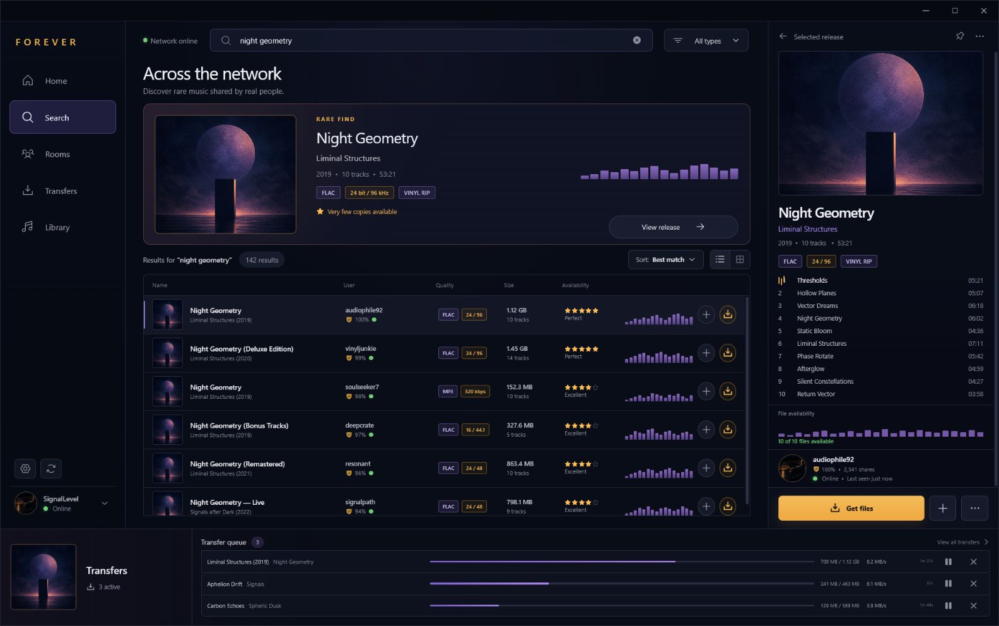

# Forever

Forever is a fast, polished desktop client for the Soulseek network, built with
Rust, Tauri 2, React, and TypeScript.

> **Status:** pre-alpha. Version `0.0.2` adds the first real Soulseek
> connection: secure local credential storage, live login state, reconnects,
> first-run setup, and connection settings. Search results and transfers still
> use local development data.



## Current foundation

- Faithful Midnight Radio desktop interface
- First-run Soulseek account setup with native download-folder selection
- Live TCP login to the Soulseek server with explicit connecting,
  authenticating, online, reconnecting, offline, and error states
- Automatic reconnect with bounded exponential backoff and optional connection
  on startup
- Passwords stored in Windows Credential Manager, or held only in memory when
  “Remember password” is disabled
- Non-secret JSON connection preferences and sanitized local diagnostics
- Search, selection, filtering, inspector, and transfer interactions using local
  development data
- Custom frameless Windows shell and branded application icons
- In-app update checks with a toast, release modal, progress, verification, and
  restart flow
- GitHub CI for linting, typechecking, frontend tests, Rust formatting, Clippy,
  and Rust tests
- Automatic GitHub Releases containing NSIS `.exe` and WiX `.msi` installers
- Signed Tauri updater artifacts, `latest.json`, and SHA-256 checksums

## Requirements

- Node.js 22
- Rust stable
- Windows development prerequisites from the
  [Tauri documentation](https://v2.tauri.app/start/prerequisites/)

## Development

```powershell
npm install
npm run tauri dev
```

The frontend can also run independently:

```powershell
npm run dev
```

Use `http://localhost:1420/?update=available` during frontend development to
preview the update toast and modal without publishing a release.

Use `http://localhost:1420/?onboarding=1` to preview the fresh-install
connection flow. The browser preview simulates connection state; run
`npm run tauri dev` to exercise the native credential vault and live Soulseek
login.

## Connection data and privacy

Forever writes non-secret account preferences to the Tauri application
configuration directory and connection events to
`logs/connection.log`. Passwords are excluded from both. With “Remember
password” enabled, Windows Credential Manager stores the password; otherwise it
exists only for the current app session.

The legacy Soulseek protocol itself does not provide transport encryption.
Credential protection described above applies to local storage, not the
connection between the client and Soulseek server. Use a unique password that
you do not reuse for another service.

## Quality checks

```powershell
npm run check
Set-Location src-tauri
cargo fmt --all -- --check
cargo clippy --all-targets --all-features -- -D warnings
cargo test --all-targets --all-features
```

## Release process

Every application release uses the same version in:

- `package.json`
- `src-tauri/Cargo.toml`
- `src-tauri/tauri.conf.json`
- the dated `CHANGELOG.md` release heading

Validate them locally with:

```powershell
npm run verify:version
```

Pushing a new version to `master` automatically runs the release workflow. Once
all frontend and Rust checks pass, GitHub Actions creates a `vX.Y.Z` tag and
publishes a GitHub Release containing:

- `Forever_X.Y.Z_x64-setup.exe` — recommended current-user Windows installer
- `Forever_X.Y.Z_x64.msi` — Windows Installer package
- updater signatures
- `latest.json`
- `SHA256SUMS.txt`

The release workflow requires the repository secret
`TAURI_SIGNING_PRIVATE_KEY`. The corresponding public key is compiled into the
application. Keep the private updater key backed up securely; losing it prevents
installed clients from accepting future updates.

Windows Authenticode signing is separate from Tauri updater signing. Until a
code-signing certificate is configured, Windows SmartScreen may warn when the
installer is downloaded.

## Project structure

```text
src/                    React interface, connection UX, and updater experience
src-tauri/              Rust/Tauri app, Soulseek connection service, and bundling
.github/workflows/      CI and automatic Windows release pipelines
design/concepts/        Approved design explorations
public/assets/          Production raster assets
scripts/                Release validation utilities
```
