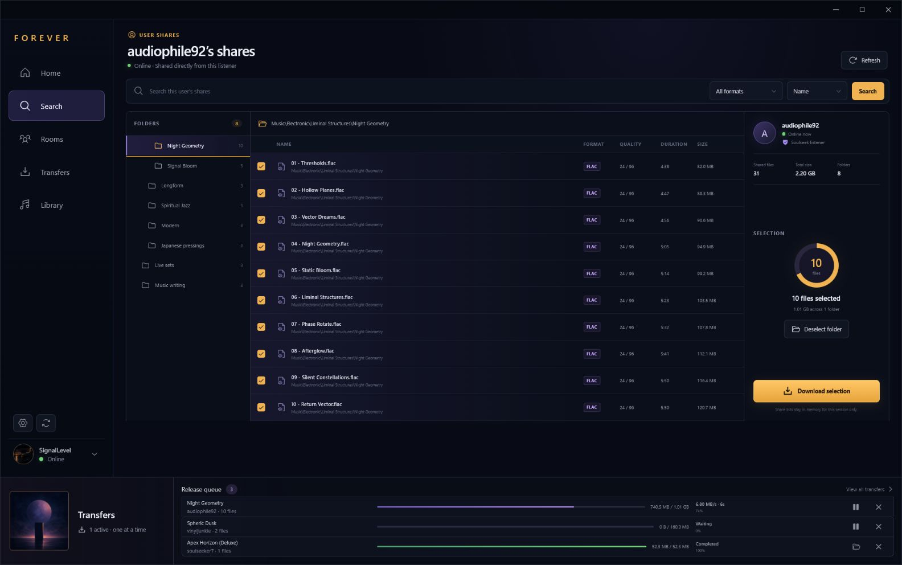

# Forever

Forever is a fast, polished desktop client for the Soulseek network, built with
Rust, Tauri 2, React, and TypeScript.

> **Status:** pre-alpha. Version `0.0.17` is a startup hotfix for the `0.0.16`
> MusicBrainz TLS regression. It retains complete-release sharing, the dedicated
> Browse workspace, and catalog-guided album discovery.

If `0.0.16` is installed, download and run the `0.0.17` Windows installer
manually; the startup regression prevents `0.0.16` from opening its in-app
updater. Installing the hotfix over the existing copy preserves Forever's
configuration and transfers.



## Current foundation

- Faithful Midnight Radio desktop interface
- First-run Soulseek account setup with native download-folder selection and
  a clear explanation of automatic username registration
- Live TCP login to the Soulseek server with explicit connecting,
  authenticating, online, reconnecting, offline, and error states
- Automatic reconnect with bounded exponential backoff and optional connection
  on startup
- Live Soulseek search with direct and indirect peer-response handling,
  streamed and deduplicated results, a 15-second response window, and bounded
  protocol parsing
- Working lossless/compressed filters, ready/speed/size sorting, stop control,
  and a live file inspector with source speed, queue, and share visibility
- A Files/Albums search switch with MusicBrainz artist matching, artist
  disambiguation, studio/live/compilation/EP catalog filters, Cover Art Archive
  artwork, and one-click artist-plus-album handoff to live Soulseek file search
- A dedicated top-level Browse workspace with exact-username entry and recent
  or favorite listener shortcuts, keeping full share trees separate from Search
- A dedicated People workspace with live online/away/offline presence,
  country flags, profile descriptions and images, interests, share/upload
  statistics, persistent favorites, ignored and banned listeners, and recent
  sources
- Profile entry points and country flags in Search, User Shares, Transfers,
  uploads, and the transfer shelf
- A dedicated two-pane Midnight Inbox for native Soulseek private messages,
  with persistent per-user history, unread and presence indicators, full-history
  search, exact-username starts, drafts, and an online-aware composer
- Queued, sent, and failed outgoing-message states with retry, plus mark
  read/unread, clear-history, and remove-conversation controls
- Configurable native Windows notifications for incoming private messages
- Separate Ignore User filtering for messages/search activity and Ban User
  protection for local share browsing, queues, and downloads
- Real single-file downloads from live results using direct and indirect peer
  connections, with one active file at a time
- Live source-folder inspection using Soulseek Folder Contents requests, with
  complete subfolder results, file sizes, formats, and available audio quality
  attributes
- Complete user-share browsing using Soulseek's compressed Shared File List
  exchange, including public/private folder metadata, bounded parsing, a
  session-only cache, local filename/path search, format filters, and sorting
- A three-pane User Shares Explorer with folder navigation, detailed file
  metadata, folder-name and file search, expandable/collapsible hierarchy,
  multi-folder selection, selected-byte totals, and direct handoff to the
  grouped transfer queue
- A polished release selector with per-file choices, Select all/Deselect all,
  selected-file counts, and aggregate download size
- Whole-release enqueue into a collision-free local release folder, with
  persisted file order and resume state across restarts
- Persistent transfers with source-queue position, byte progress, speed, ETA,
  pause, resume, retry, cancel, completion, and Show in folder controls
- A full release-grouped Transfers workspace with All, Active, Queued,
  Completed, and Failed filters, transfer search, aggregate and per-file
  progress, release-level controls, Clear completed, and native completion
  notifications
- Persistent local shared-folder configuration with native selection,
  enable/disable, removal, rescanning, virtual aliases, and indexed totals
- Bounded background indexing for complete release folders—including audio,
  artwork, lyrics, cue sheets, logs, booklets, checksums, playlists, archives,
  and extensionless files—while excluding hidden entries, symbolic links,
  zero-byte or partial/temporary files, and unsafe root overlaps
- Live Soulseek browse and folder responses for local shares without exposing
  absolute filesystem paths
- Full leaf participation in Soulseek's distributed search network, including
  parent discovery, branch-root delivery, reconnect recovery, and real search
  responses from the local share index
- Indexed global-search matching with required words, `-excluded` words, and
  `*partial` terms, plus bounded deduplication and request-rate controls
- Live global-search relay state, branch discovery, request counters, and safe
  connection diagnostics in Settings
- Real resumable uploads with queue positions, one to three configurable slots,
  progress, speed, ETA, cancellation, failure states, and an Uploads workspace
- Safe `.part` files, resumable offsets, exact-size checks, sanitized local
  names, collision-free destinations, and no overwrite of existing files
- Passwords stored in Windows Credential Manager, or held only in memory when
  “Remember password” is disabled
- Non-secret JSON connection preferences and sanitized local diagnostics
- Local design-preview data when the React frontend runs outside Tauri
- Custom frameless Windows shell and branded application icons
- In-app update checks at startup and every five minutes by default, with a
  persistent cadence setting, toast, release modal, progress, verification,
  changelog-backed release highlights, and restart flow
- GitHub CI for linting, typechecking, frontend tests, Rust formatting, Clippy,
  and Rust tests
- Automatic GitHub Releases containing NSIS `.exe` and WiX `.msi` installers
- Signed Tauri updater artifacts, `latest.json`, and SHA-256 checksums

## Requirements

- Node.js 22
- Rust stable
- Windows development prerequisites from the
  [Tauri documentation](https://v2.tauri.app/start/prerequisites/)

## Development

```powershell
npm install
npm run tauri dev
```

The frontend can also run independently:

```powershell
npm run dev
```

Use `http://localhost:1420/?update=available` during frontend development to
preview the update toast and modal without publishing a release.

Use `http://localhost:1420/?onboarding=1` to preview the fresh-install
connection flow. The browser preview simulates connection state; run
`npm run tauri dev` to exercise the native credential vault and live Soulseek
login, network search, folder browsing, downloads, and uploads. Search for an artist,
album, track, or filename while connected; results stream into the table as
peers respond. Each search listens for responses for 15 seconds and can be
stopped early. Select a live file and choose **Browse folder** to request its
complete source folder. Choose the files you want, then select **Download**;
Forever creates a safe release folder beneath the download location configured
in Connection settings and adds the files in their displayed order. Choose the
folder icon on any result—or **Browse shares** in the source inspector—to open
that listener's complete shares. Source names in the transfer shelf and full
Transfers workspace open the listener's People profile, where complete shares
remain one action away. Expand or collapse branches in the
folder rail. Share-list search returns matching folders and files locally after
the list is received; choose a folder result to open it directly. **Refresh**
explicitly asks the peer again.

Switch Search from **Files** to **Albums** to enter an artist name. Forever
uses MusicBrainz to resolve the artist and show cataloged studio albums, live
albums, compilations, and EPs. Choosing **Search Soulseek** returns to Files and
starts a normal live Soulseek search for that artist and album title. MusicBrainz
identifies the release; it does not claim that a specific rip or edition is
available. Soulseek results remain the source of truth for actual files.

Open **Browse** for a dedicated exact-username entry point plus recent and
favorite listeners. Browsing from Search, People, or Transfers opens the same
workspace, and **Browse another** returns to its listener picker.

Open **People** to revisit recent sources and favorites, see their live
presence and country, inspect profile notes and interests, or browse everything
they share. Listener names in Search and Transfers open the same profile. The
**Message** action opens that listener in the dedicated **Messages** workspace.
Search conversations and message text, start a thread with an exact username,
keep drafts while navigating, and retry an interrupted outgoing message. Each
thread can be marked read or unread, cleared, or removed. **Ignore User** hides
that listener's new private messages and search activity on this device. **Ban
User** prevents that listener from browsing, queuing, or downloading your
shares until the ban is removed.

Add releases under **Settings → Your shared releases**. Forever gives each
selected root a virtual alias, indexes every safe, non-empty regular file in the
background, and announces the resulting public counts to Soulseek. This keeps
cover artwork, lyrics, cue sheets, logs, booklets, checksums, playlists, and
other companion files beside the audio. Disable a root without forgetting it,
rescan after changing files, and choose one to three outgoing upload slots.
Incoming browse, folder, global-search, queue, and download requests are then
served from the safe in-memory index. Connection settings shows whether
Forever has joined the global-search relay and how many requests it has
received and answered. Follow outgoing activity under **Transfers → Uploads**.

Version `0.0.17` intentionally keeps one active download at a time, even when an
entire release is queued. Uploads default to one slot and can be raised to
three. Edition/pressing lookup, Library management, playback, rooms, and public
chat remain outside this release.

Soulseek does not have a separate sign-up step. Connecting with a valid unused
username creates that account using the password you enter; only an existing
username can return a wrong-password error. Forever explains this in onboarding
and Connection settings rather than treating a successful registration as an
authentication failure.

Automatic update checks run every five minutes while Forever is open. Change
the cadence—or limit automatic checks to startup—in **Settings → Connection →
Automatic update checks**. Incoming private-message notifications can be
enabled or disabled in the same settings panel.

## Connection data and privacy

Forever writes non-secret account preferences to the Tauri application
configuration directory and connection events to
`logs/connection.log`. Release grouping, file order, and transfer metadata are
stored in `transfers.json` in the same configuration directory. Favorites,
ignored listeners, banned listeners, and recent source usernames are stored in
`people.json`. Bounded private-message history, unread state, and outgoing
delivery status are stored in `messages.json`. Bounded unsent drafts and the
message-notification preference are stored in the local WebView profile;
profile notes, profile images, interests, country, presence, and statistics
remain in memory for the current session. Shared-root
configuration and upload-slot count are stored separately in `sharing.json`;
the file contains local folder paths because Forever must reopen those roots,
but it never leaves the device. Peer IP
addresses, temporary folder listings, cached user share lists, and credentials
are excluded. Share lists stay in memory only for the current app session.
Passwords are excluded from both. With “Remember
password” enabled, Windows Credential Manager stores the password; otherwise it
exists only for the current app session.

The legacy Soulseek protocol itself does not provide transport encryption.
Credential protection described above applies to local storage, not the
connection between the client and Soulseek server. Use a unique password that
you do not reuse for another service.

Album discovery sends the artist name over HTTPS to MusicBrainz and loads
available release artwork from the Cover Art Archive. Artist and release-group
responses are held in bounded memory caches for up to six hours and are not
written to Forever's configuration files. Requests use Forever's identifying
User-Agent, a 15-second timeout, and a rate below one MusicBrainz request per
second.

Live searches are sent to the Soulseek server, and responding peers connect to
Forever’s temporary listening port or receive an indirect connection attempt.
Forever limits concurrent peer connections, message sizes, decompressed
payloads, per-peer entries, and each search to 5,000 displayed files. Peer
addresses are used for the active protocol exchange and are not exposed in the
interface or written to diagnostics.

Incomplete files use a `.part` suffix and remain resumable. Forever accepts a
file stream only when its username, exact remote filename, transfer token, and
announced size match the active queue item. Folder responses must also match
the requesting user, request token, and exact requested folder. The Soulseek
Shared File List parser bounds peer frames, decompressed payloads, directory
counts, file counts, and file attributes before caching a response. The
protocol does not provide chunk hashes, so v0.0.17 verifies the expected byte
count but cannot cryptographically verify file contents.

## Quality checks

```powershell
npm run check
Set-Location src-tauri
cargo fmt --all -- --check
cargo clippy --all-targets --all-features -- -D warnings
cargo test --all-targets --all-features
```

The Windows release workflow also builds the packaged executable before
publication, launches it for an eight-second startup smoke window, and fails
the release if the process exits. This complements the Rust regression test
that constructs the MusicBrainz client with its explicit TLS provider.

## Release process

Every application release uses the same version in:

- `package.json`
- `src-tauri/Cargo.toml`
- `src-tauri/tauri.conf.json`
- the dated `CHANGELOG.md` release heading

Validate them locally with:

```powershell
npm run verify:version
```

Pushing a new version to `master` automatically runs the release workflow. Once
all frontend and Rust checks pass, GitHub Actions creates a `vX.Y.Z` tag and
publishes a GitHub Release containing:

- `Forever_X.Y.Z_x64-setup.exe` — recommended current-user Windows installer
- `Forever_X.Y.Z_x64.msi` — Windows Installer package
- updater signatures
- `latest.json`
- `SHA256SUMS.txt`

The release workflow requires the repository secret
`TAURI_SIGNING_PRIVATE_KEY`. The corresponding public key is compiled into the
application. Keep the private updater key backed up securely; losing it prevents
installed clients from accepting future updates.

Windows Authenticode signing is separate from Tauri updater signing. Until a
code-signing certificate is configured, Windows SmartScreen may warn when the
installer is downloaded.

## Project structure

```text
src/                    React interface, connection UX, and updater experience
src-tauri/              Rust/Tauri app, Soulseek connection service, and bundling
.github/workflows/      CI and automatic Windows release pipelines
design/concepts/        Approved design explorations
public/assets/          Production raster assets
scripts/                Release validation utilities
```
