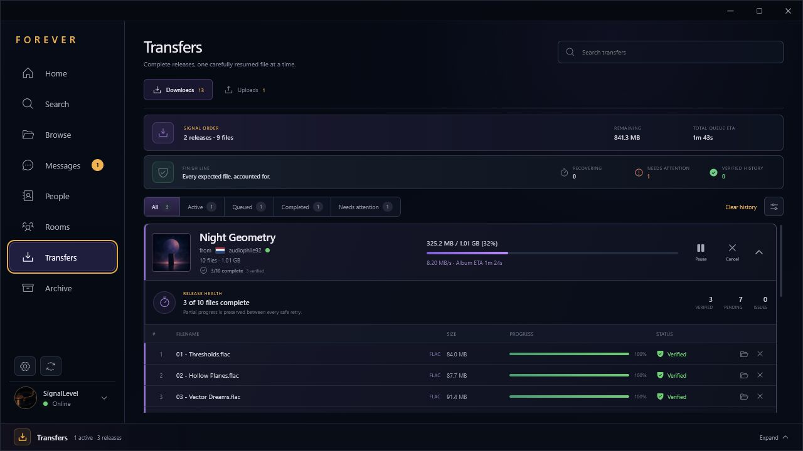
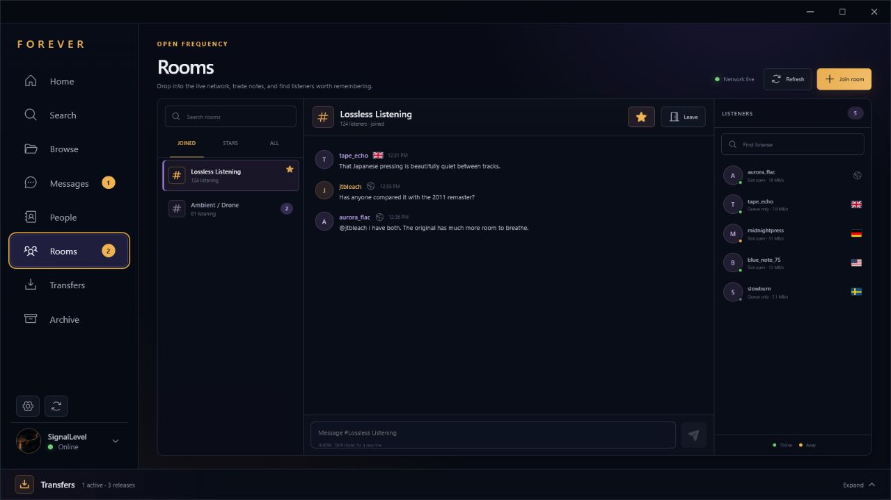
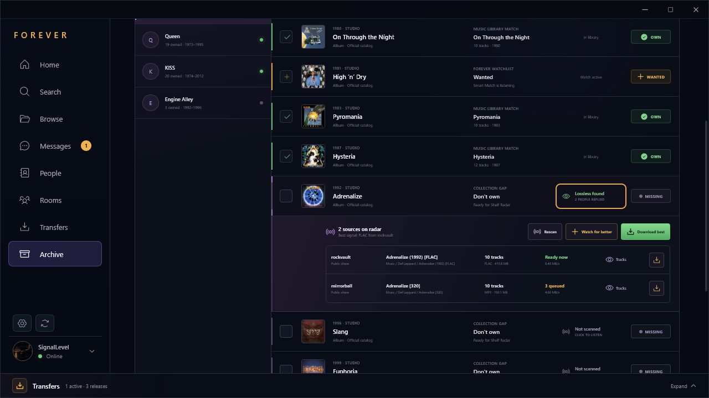
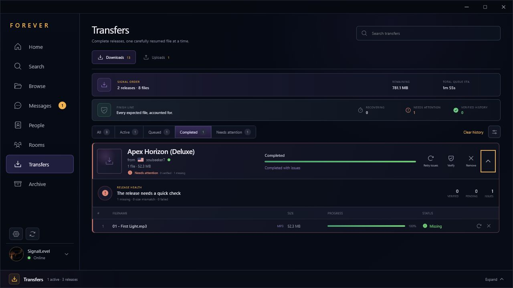

# Forever

Forever is a fast, polished desktop client for the Soulseek network, built with
Rust, Tauri 2, React, and TypeScript.

> **Status:** pre-alpha. Version `0.0.35` delivers Signal Breadcrumbs with
> React 19-compliant focus and notification lifecycles that pass the complete
> release quality gate.

If `0.0.16` is installed, download and run the latest `0.0.35` Windows installer
manually; the startup regression prevents `0.0.16` from opening its in-app
updater. Installing the hotfix over the existing copy preserves Forever's
configuration and transfers.





## Current foundation

- Faithful Midnight Radio desktop interface
- First-run Soulseek account setup with native download-folder selection and
  a clear explanation of automatic username registration
- Live TCP login to the Soulseek server with explicit connecting,
  authenticating, online, reconnecting, offline, and error states
- Automatic reconnect with bounded exponential backoff and optional connection
  on startup
- Live Soulseek search with direct and indirect peer-response handling,
  streamed and deduplicated results, a 15-second response window, and bounded
  protocol parsing
- Working lossless/compressed filters, ready/speed/size sorting, stop control,
  and a live file inspector with source speed, queue, and share visibility
- A Files/Albums search switch with MusicBrainz artist matching, artist
  disambiguation, studio/live/compilation/EP catalog filters, Cover Art Archive
  artwork, and one-click artist-plus-album handoff to grouped Soulseek sources
- Album-source results grouped by listener and remote folder, with track count,
  formats, aggregate search size, readiness and speed, hover/focus track-list
  previews, an individual-file fallback, complete-folder download, and live
  **Downloading** or numbered **Queued #1**, **Queued #2** actions that stay
  synchronized as releases are reordered, paused, completed, failed, or removed
- A dedicated Archive workspace that opens Music Library's
  `music-library.sqlite3` database with SQLite read-only and query-only
  enforcement, reports its latest import and inventory totals, and never adds
  Forever downloads to the external collection
- A selective **Missing Shelf** that searches artists already present in Music
  Library, prefers its verified MusicBrainz artist links and cached official
  release groups, compares only the artist you open, and shows studio-album
  completion plus **Own**, **Wanted**, and **Missing** states
- Studio, Live, Compilation, EP, and decade filters, selection of visible
  collection gaps, and an atomic bulk handoff of up to 100 missing releases to
  Wanted using one shared Smart Match profile without duplicate watches
- **Shelf Radar** scans one missing album, up to 12 selected albums, or up to 12
  visible gaps without replacing the main Search workspace; scans are explicit,
  sequential, cancellable, and held only for the current app session
- Live Shelf Radar states for queued, scanning, no sources, sources found, and
  lossless found, plus expandable grouped folders with listener, format, track
  count, size, upload slot, speed, queue, and track-list details
- Direct **Download best**, per-source download, rescan, and **Watch for better**
  actions inside Missing Shelf, with live transfer-state icons and queue position
  feedback after an album is handed off
- Shared **Signal Breadcrumbs** across Album Search, Missing Shelf, Wanted, and
  Browse Shares show numbered queue position, live percentage, pause,
  completion, and failure from the persisted transfer snapshot; selecting one
  opens and highlights the exact release in Transfers
- Batched **Owned** and **Don't own** markers across MusicBrainz discographies
  and Soulseek album-source reports, matched from the Archive's normalized
  artist, album, release-year, and track-count metadata
- A separate **Wanted Signals** watchlist for albums that are still missing,
  with 15-minute, 30-minute, hourly, or manual background checks, per-album
  pause/check/remove controls, in-app and Windows availability alerts, and
  configurable **Smart Match** profiles for format, minimum bitrate, and track
  count
- Ranked Smart Match recommendations based on completeness, format, upload-slot
  readiness, speed, and queue length, with a remote-folder review that preserves
  artwork, cue sheets, lyrics, logs, and other companion files when explicitly
  queueing the complete album
- Automatic **Fulfilled** Wanted state when the external read-only Archive
  reports an owned album, without importing Forever downloads or modifying the
  Music Library database
- A dedicated top-level Browse workspace with exact-username entry and recent
  or favorite listener shortcuts, keeping full share trees separate from Search
- A dedicated People workspace with live online/away/offline presence,
  country flags, profile descriptions and images, interests, share/upload
  statistics, persistent favorites, ignored and banned listeners, and recent
  sources
- Profile entry points and country flags in Search, User Shares, Transfers,
  uploads, and the transfer shelf
- A dedicated two-pane Midnight Inbox for native Soulseek private messages,
  with persistent per-user history, unread and presence indicators, full-history
  search, exact-username starts, drafts, and an online-aware composer
- Queued, sent, and failed outgoing-message states with retry, plus mark
  read/unread, clear-history, and remove-conversation controls
- Configurable native Windows notifications for incoming private messages
- A dedicated three-pane **Open Frequency** workspace for native Soulseek
  public rooms, with room search, Joined/Stars/All filters, join/leave,
  auto-rejoin, unread and mention badges, and a live room composer
- A room listener rail with presence, country, upload-slot availability,
  reported speed and share totals, plus Profile, Message, Browse, Save, Ignore,
  and Ban actions
- Bounded local room history and configurable native Windows notifications for
  mentions and new messages in starred rooms
- Separate Ignore User filtering for messages/search activity and Ban User
  protection for local share browsing, queues, and downloads
- Real single-file downloads from live results using direct and indirect peer
  connections, with one active file at a time
- Live source-folder inspection using Soulseek Folder Contents requests, with
  complete subfolder results, file sizes, formats, and available audio quality
  attributes
- Complete user-share browsing using Soulseek's compressed Shared File List
  exchange, including public/private folder metadata, bounded parsing, a
  session-only cache, local filename/path search, format filters, and sorting
- A three-pane User Shares Explorer with folder navigation, detailed file
  metadata, folder-name and file search, expandable/collapsible hierarchy,
  multi-folder selection, selected-byte totals, and direct handoff to the
  grouped transfer queue
- A polished release selector with per-file choices, Select all/Deselect all,
  selected-file counts, and aggregate download size
- Whole-release enqueue into a collision-free local release folder, with
  MusicBrainz-guided `Artist - Album (Year)` naming plus persisted file order
  and resume state across restarts
- Persistent transfers with source-queue position, byte progress, speed, ETA,
  pause, resume, retry, cancel, completion, and Show in folder controls
- Bounded automatic recovery for transient peer interruptions with visible
  retry attempts and countdowns while preserving safe `.part` progress
- **Finish Line** release health with expected-file verification, Moved,
  Missing, and Size mismatch states, a Needs attention filter, manual
  recheck/retry actions, and persistent completion history that never deletes
  downloaded files
- Exact alternative-source switching for album queues, preserving verified
  files and accepting a replacement only when basename and byte size match
- A full release-grouped Transfers workspace with All, Active, Queued,
  Completed, and Needs attention filters, transfer search, aggregate and
  per-file progress, whole-album ETA, release-level controls, Clear history,
  and in-app plus native completion notifications
- Clickable queue/start/failure/completion notifications and transfer-shelf
  release titles provide a direct route to the expanded release without
  interrupting discovery when a download is first queued
- A persistent **Signal Order** for queued albums with drag-and-drop,
  keyboard-friendly Move up/Move down controls, **Download next**, exact
  duplicate-source protection, and a queue-wide release/file/size/ETA summary,
  plus a collapsed-by-default bottom drawer for quick status without sacrificing
  workspace height
- Persistent local shared-folder configuration with native selection,
  enable/disable, removal, rescanning, virtual aliases, and indexed totals
- Bounded background indexing for complete release folders—including audio,
  artwork, lyrics, cue sheets, logs, booklets, checksums, playlists, archives,
  and extensionless files—while excluding hidden entries, symbolic links,
  zero-byte or partial/temporary files, and unsafe root overlaps
- Live Soulseek browse and folder responses for local shares without exposing
  absolute filesystem paths
- Full leaf participation in Soulseek's distributed search network, including
  parent discovery, branch-root delivery, reconnect recovery, and real search
  responses from the local share index
- Indexed global-search matching with required words, `-excluded` words, and
  `*partial` terms, plus bounded deduplication and request-rate controls
- Live global-search relay state, branch discovery, request counters, and safe
  connection diagnostics in Settings
- Real resumable uploads with queue positions, one to three configurable slots,
  progress, speed, ETA, cancellation, failure states, and an Uploads workspace
- Safe `.part` files, resumable offsets, exact-size checks, sanitized local
  names, collision-free destinations, and no overwrite of existing files
- Passwords stored in Windows Credential Manager, or held only in memory when
  “Remember password” is disabled
- Non-secret JSON connection preferences and sanitized local diagnostics
- Local design-preview data when the React frontend runs outside Tauri
- Custom frameless Windows shell and branded application icons
- In-app update checks at startup and every five minutes by default, with a
  persistent cadence setting, toast, release modal, progress, verification,
  changelog-backed release highlights, and restart flow
- GitHub CI for linting, typechecking, frontend tests, Rust formatting, Clippy,
  and Rust tests
- Automatic GitHub Releases containing NSIS `.exe` and WiX `.msi` installers
- Signed Tauri updater artifacts, `latest.json`, and SHA-256 checksums

## Requirements

- Node.js 22
- Rust stable
- Windows development prerequisites from the
  [Tauri documentation](https://v2.tauri.app/start/prerequisites/)

## Development

```powershell
npm install
npm run tauri dev
```

The frontend can also run independently:

```powershell
npm run dev
```

Use `http://localhost:1420/?update=available` during frontend development to
preview the update toast and modal without publishing a release.

Use `http://localhost:1420/?onboarding=1` to preview the fresh-install
connection flow. The browser preview simulates connection state; run
`npm run tauri dev` to exercise the native credential vault and live Soulseek
login, network search, folder browsing, downloads, and uploads. Search for an artist,
album, track, or filename while connected; results stream into the table as
peers respond. Each search listens for responses for 15 seconds and can be
stopped early. Select a live file and choose **Browse folder** to request its
complete source folder. Choose the files you want, then select **Download**;
Forever creates a safe release folder beneath the download location configured
in Connection settings and adds the files in their displayed order. Choose the
folder icon on any result—or **Browse shares** in the source inspector—to open
that listener's complete shares. Source names in the transfer shelf and full
Transfers workspace open the listener's People profile, where complete shares
remain one action away. Expand or collapse branches in the
folder rail. Share-list search returns matching folders and files locally after
the list is received; choose a folder result to open it directly. **Refresh**
explicitly asks the peer again.

Switch Search from **Files** to **Albums** to enter an artist name. Forever
uses MusicBrainz to resolve the artist and show cataloged studio albums, live
albums, compilations, and EPs. Choosing **Search Soulseek** returns to Files and
starts a normal live Soulseek search for that artist and album title. MusicBrainz
identifies the release; it does not claim that a specific rip or edition is
available. Soulseek results remain the source of truth for actual files. The
search opens in **Album sources**, grouping returned files by listener and
folder. Hover or focus the eye control to preview that source's tracks; switch
to **Individual files** for the original file-by-file results. **Download
album** inspects the chosen folder and queues every file in it, including cover
art, lyrics, cue sheets, and other companion files. Search stays open so more
albums can be added: the active source turns green and reads **Downloading**,
while later sources turn blue and read **Queued**. When MusicBrainz supplied
the catalog context, the destination is named `Artist - Album (Year)`; without
that context Forever falls back to the shared folder name.

Open **Archive** to inspect the external Music Library source. On Windows,
Forever discovers it at
`%APPDATA%\com.local.musiclibrary\music-library.sqlite3`, reads the latest
completed import plus the normalized `albums` inventory, and uses that data to
mark cataloged releases as **Owned** or **Don't own**. **Refresh Archive** picks
up a newer Music Library import. Forever opens this database using SQLite's
read-only flag and query-only mode; it has no Archive write command. Soulseek
downloads continue to use the folder configured under Connection settings and
are never imported into Archive.

Open **Archive → Missing shelf** to browse or search artists found in Music
Library. Forever initially shows a bounded list and does not scan every artist's
catalog in the background. Selecting one artist first uses Music Library's
verified MusicBrainz link and cached official release groups when available;
only that selected shelf can trigger a live MusicBrainz fallback. If the local
artist is not linked, choose the correct MusicBrainz identity for the current
session—Forever does not write that choice back to Music Library. Completed
artist comparisons are reused for the current app session and cleared by
**Refresh Archive**.

The shelf reports studio-album completion and labels each release **Own**,
**Wanted**, or **Missing**. Filter the catalog by Studio, Live, Compilation, EP,
or decade, select one or more visible gaps, choose a shared Smart Match format,
bitrate, and optional track minimum, then use **Add to Wanted**. The bulk action
deduplicates existing watches and writes once to Forever's separate
`wanted.json`; the Music Library database remains untouched.

Use **Scan visible** to check up to the first 12 visible missing albums, or
select specific gaps and use **Scan selected**. Shelf Radar sends one search at
a time, listens for 12 seconds, and pauses briefly between albums. Its progress
strip shows the current album and can stop the remaining queue immediately.
Scanning never replaces or clears the main Search workspace.

Completed scans stay in memory for the current app session. A release reports
whether no sources answered, grouped sources were found, or a lossless folder
is available. Open the signal to compare up to five responding folders and
preview their audio tracks. **Download best** inspects the recommended remote
folder before queueing the complete release, then both the recommended button
and its exact source-row icon follow the live Preparing, Downloading, Queued,
Paused, Downloaded, or Needs attention state. **Watch for better** creates
an ordinary Wanted entry using the selected Smart Match profile. Non-audio-only
folders are excluded from album-source availability. Neither action writes to
Music Library; downloads and watches remain in Forever's own stores.



Open **Transfers** to see Finish Line health for every queued or completed
release. Transient peer disconnects retry after short bounded delays and show
their next attempt in place; pausing or cancelling still takes precedence.
When a release finishes, Forever checks that every expected local filename is
present at the expected byte size and sends an in-app and Windows completion
notification. Soulseek does not provide content hashes, so this is a structural
completion check rather than cryptographic audio verification.

Use **Verify** to recheck completed files after moving or editing them. When an
entire completed release leaves Forever's download folder together, Finish Line
classifies it as **Moved** and keeps it in safe history; **Download again** can
restore another copy if needed. Partial file loss still uses **Needs attention**
and can be safely requeued with **Retry issues**. A size mismatch is reported
but is never overwritten automatically. Album queues created from grouped
Search or Shelf Radar results retain compatible alternative listeners; expand
the release, open **Alternative signals**, and choose **Try source** to switch
only exact basename-and-size matches while already verified files remain
complete. **Clear history** removes completed transfer records only—the files
in the download folder remain untouched.



Choose **Add to Wanted** on a missing MusicBrainz album, then open **Archive →
Wanted** to follow it. Forever serializes background checks while connected and
groups returned audio by listener and remote folder without disturbing the
visible Search workspace. Edit a row's **Smart Match profile** to prefer
lossless, require lossless, or accept any format, then optionally set minimum
bitrate and track-count requirements. Qualifying folders are ranked by
completeness, format, free upload slot, speed, and queue length.

Use **Download best** to inspect the recommended folder before anything is
queued. The review shows the listener, remote path, format, tracks, aggregate
size, source speed, and the audio/companion-file split. **Queue complete album**
preserves cover art, cue sheets, lyrics, logs, and other files beside the audio
and leaves Archive open so another album can be queued. **Compare** opens the
full grouped source report with the recommendation highlighted. Forever never
auto-downloads a Smart Match. When the read-only Music Library Archive later
reports that album as owned, the watch moves to **Fulfilled** and stops checking;
it returns to the active list if the external source no longer reports it.

Open **Browse** for a dedicated exact-username entry point plus recent and
favorite listeners. Browsing from Search, People, or Transfers opens the same
workspace, and **Browse another** returns to its listener picker.

Open **People** to revisit recent sources and favorites, see their live
presence and country, inspect profile notes and interests, or browse everything
they share. Listener names in Search and Transfers open the same profile. The
**Message** action opens that listener in the dedicated **Messages** workspace.
Search conversations and message text, start a thread with an exact username,
keep drafts while navigating, and retry an interrupted outgoing message. Each
thread can be marked read or unread, cleared, or removed. **Ignore User** hides
that listener's new private messages and search activity on this device. **Ban
User** prevents that listener from browsing, queuing, or downloading your
shares until the ban is removed.

Open **Rooms** to load Soulseek's public room directory. Filter the dial to
rooms already joined, starred rooms, or the complete public list; search by
room name; then join from the directory or enter an exact public room name.
Rooms selected for joining automatically reconnect with the next Soulseek
session. Leaving a room disables that auto-rejoin preference.

Joined rooms show live chat, unread and mention markers, and a searchable
listener rail. Select a listener to inspect their reported presence, country,
upload-slot availability, speed, shared files, and folders, or jump directly
to Profile, Message, and Browse shares. Save, Ignore, and Ban reuse the People
workspace's existing device-local preferences. Room history is bounded to the
most recent 250 messages in each of at most 64 remembered rooms. Private-room
administration is not part of v0.0.31.

Add releases under **Settings → Your shared releases**. Forever gives each
selected root a virtual alias, indexes every safe, non-empty regular file in the
background, and announces the resulting public counts to Soulseek. This keeps
cover artwork, lyrics, cue sheets, logs, booklets, checksums, playlists, and
other companion files beside the audio. Disable a root without forgetting it,
rescan after changing files, and choose one to three outgoing upload slots.
Incoming browse, folder, global-search, queue, and download requests are then
served from the safe in-memory index. Connection settings shows whether
Forever has joined the global-search relay and how many requests it has
received and answered. Follow outgoing activity under **Transfers → Uploads**.

Version `0.0.31` intentionally keeps one active download at a time, even when an
entire release is queued. Uploads default to one slot and can be raised to
three. Edition/pressing lookup, playback, and private-room administration
remain outside this release.

Soulseek does not have a separate sign-up step. Connecting with a valid unused
username creates that account using the password you enter; only an existing
username can return a wrong-password error. Forever explains this in onboarding
and Connection settings rather than treating a successful registration as an
authentication failure.

Automatic update checks run every five minutes while Forever is open. Change
the cadence—or limit automatic checks to startup—in **Settings → Connection →
Automatic update checks**. Incoming private-message notifications can be
enabled or disabled in the same settings panel. Room alerts have a separate
toggle and notify only for direct mentions or new messages in starred rooms.

## Connection data and privacy

Forever writes non-secret account preferences to the Tauri application
configuration directory and connection events to
`logs/connection.log`. Release grouping, file order, and transfer metadata are
stored in `transfers.json` in the same configuration directory. Favorites,
ignored listeners, banned listeners, and recent source usernames are stored in
`people.json`. Bounded private-message history, unread state, and outgoing
delivery status are stored in `messages.json`. Bounded unsent drafts and the
message-notification preference are stored in the local WebView profile.
Room favorites, auto-rejoin choices, and bounded history are stored in
`rooms.json`; the room-notification preference is stored in the local WebView
profile. Live room member lists are session-only;
profile notes, profile images, interests, country, presence, and statistics
remain in memory for the current session. Shared-root
configuration and upload-slot count are stored separately in `sharing.json`;
the file contains local folder paths because Forever must reopen those roots,
but it never leaves the device. Peer IP
addresses, temporary folder listings, cached user share lists, and credentials
are excluded. Share lists stay in memory only for the current app session.
Passwords are excluded from both. With “Remember
password” enabled, Windows Credential Manager stores the password; otherwise it
exists only for the current app session.

Wanted albums, their configurable check rhythm, per-album Smart Match profiles,
last ranked source summary, fulfillment state, and source identity fingerprints
are stored in Forever's `wanted.json`. These fingerprints contain normalized
Soulseek usernames and remote folder names so Forever can recognize newly
appearing qualifying sources; they never contain local Music Library rows and
are not written to the external Archive database.

Archive reads the external Music Library database at
`%APPDATA%\com.local.musiclibrary\music-library.sqlite3`. Forever uses the
`import_runs` and `albums` tables for source status and ownership matching. For
Missing Shelf it also reads verified rows from `musicbrainz_artist_links` and
cached official rows from `musicbrainz_artist_release_groups`; absent tables or
links fall back safely without schema changes. The connection is opened with
`SQLITE_OPEN_READ_ONLY`, a two-second busy timeout, and `PRAGMA query_only = ON`;
Forever never migrates, creates, updates, or deletes anything in this database.
Album and track totals come from the latest completed import record rather than
a scan of the 1.8 GB source.

The legacy Soulseek protocol itself does not provide transport encryption.
Credential protection described above applies to local storage, not the
connection between the client and Soulseek server. Use a unique password that
you do not reuse for another service.

Album discovery sends the artist name over HTTPS to MusicBrainz and loads
available release artwork from the Cover Art Archive. Artist and release-group
responses are held in bounded memory caches for up to six hours and are not
written to Forever's configuration files. Requests use Forever's identifying
User-Agent, a 15-second timeout, and a rate below one MusicBrainz request per
second.

Live searches are sent to the Soulseek server, and responding peers connect to
Forever’s temporary listening port or receive an indirect connection attempt.
Forever limits concurrent peer connections, message sizes, decompressed
payloads, per-peer entries, and each search to 5,000 displayed files. Peer
addresses are used for the active protocol exchange and are not exposed in the
interface or written to diagnostics.

Incomplete files use a `.part` suffix and remain resumable. Forever accepts a
file stream only when its username, exact remote filename, transfer token, and
announced size match the active queue item. Folder responses must also match
the requesting user, request token, and exact requested folder. The Soulseek
Shared File List parser bounds peer frames, decompressed payloads, directory
counts, file counts, and file attributes before caching a response. The
protocol does not provide chunk hashes, so v0.0.33 verifies the expected
filename presence and byte count but cannot cryptographically verify file
contents. Finish Line reports a size mismatch instead of replacing that local
file automatically.

## Quality checks

```powershell
npm run check
Set-Location src-tauri
cargo fmt --all -- --check
cargo clippy --all-targets --all-features -- -D warnings
cargo test --all-targets --all-features
```

The Windows release workflow also builds the packaged executable before
publication, launches it for an eight-second startup smoke window, and fails
the release if the process exits. This complements the Rust regression test
that constructs the MusicBrainz client with its explicit TLS provider.

## Release process

The canonical repository is
[`soundtrackgeek/forever`](https://github.com/soundtrackgeek/forever). Tauri
checks its signed updater feed at
`https://github.com/soundtrackgeek/forever/releases/latest/download/latest.json`.

Every application release uses the same version in:

- `package.json`
- `src-tauri/Cargo.toml`
- `src-tauri/tauri.conf.json`
- the dated `CHANGELOG.md` release heading

Validate them locally with the repository metadata and updater endpoint:

```powershell
npm run verify:version
```

Pushing a new version to `master` automatically runs the release workflow. Once
all frontend and Rust checks pass, GitHub Actions creates a `vX.Y.Z` tag and
publishes a GitHub Release containing:

- `Forever_X.Y.Z_x64-setup.exe` — recommended current-user Windows installer
- `Forever_X.Y.Z_x64.msi` — Windows Installer package
- updater signatures
- `latest.json`
- `SHA256SUMS.txt`

The release workflow requires the repository secret
`TAURI_SIGNING_PRIVATE_KEY`. The corresponding public key is compiled into the
application. Keep the private updater key backed up securely; losing it prevents
installed clients from accepting future updates.

Windows Authenticode signing is separate from Tauri updater signing. Until a
code-signing certificate is configured, Windows SmartScreen may warn when the
installer is downloaded.

## Project structure

```text
src/                    React interface, connection UX, and updater experience
src-tauri/              Rust/Tauri app, Soulseek connection service, and bundling
.github/workflows/      CI and automatic Windows release pipelines
design/concepts/        Approved design explorations
public/assets/          Production raster assets
scripts/                Release validation utilities
```
